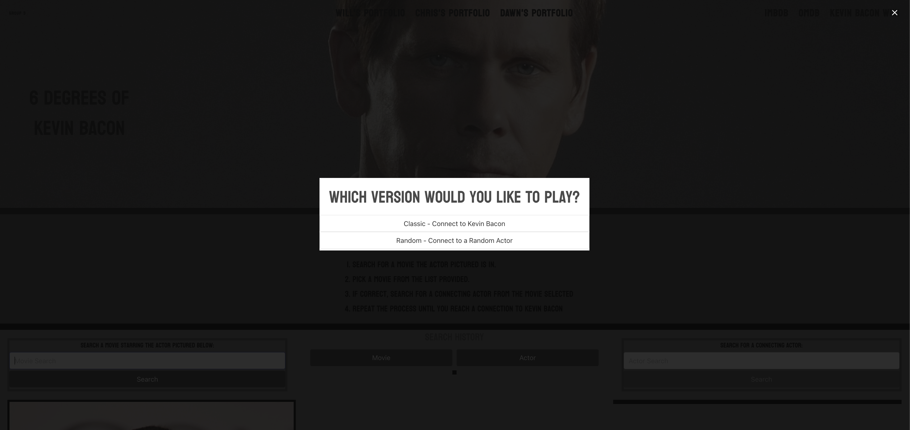
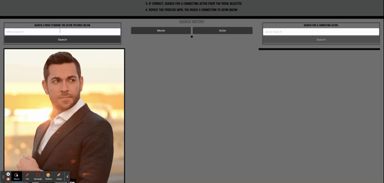
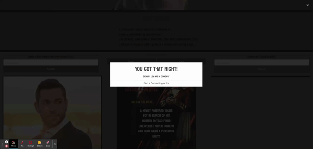
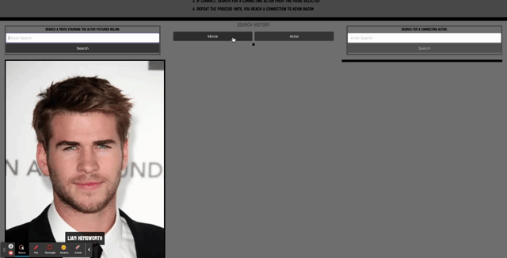

# 6 Degrees of Kevin Bacon

##  Description

As a Cinephile, also called “movie lover”, I want to be presented with a random actor, so that I can then connect that actor to another based on a movie both have performed in, continuing that process with each consecutive actor until I have a chain of connections leading to Kevin Bacon. 

Javascript is our main technology used, along with HTML and CSS. Bulma was used for adding styles to the page. Foundation modals were generated within Javascript adding styling with Bulma. Learning a new CSS framework and merging conflicts the first time were the biggest challenge we faced, and we overcame by reading more documents and testing on the website to get the CSS style works as well as communicating throughout the whole project solved the merge conflicts efficiently.

## Table of Content

1. [Link-to-the-Application](#linktotheapplication)
2. [Demo](#demo)
3. [Features](#features)
4. [Credits](#credits)
5. [Future-Development](#futuredevelopment)
6. [Authors](#authors)
7. [License](#license)

## Link-to-the-Application

https://dawnwogerman.github.io/6degreesofkevinbacon/
## Demo

- Choose the game path

- Search for the movie name according to the actor shown

- Search for a connecting actor that performed in the same movie

- Get search history and remove history in local Storage

## Features

Supports 1024px media queries(max width) written within the CSS documentation.

## Credits

Third Party Libraries: 
- [Bulma](https://bulma.io/)

APIs:

- [IMDB](https://www.imdb.com/)
- [OMDB](https://www.omdbapi.com/)

## Future-Development

1. Refactor the code
2. Degree count for each actor used
3. Display at the end the whole chain of actors used
4. Add background music into the game
5. Better optimization for smaller screens
6. Play the game in another language
7. Add animations
8. Share the game via Facebook, Twitter, Instagram

## Authors

- Wiilam Grout  [Github](https://github.com/wgrout87)
- Dawn Wogerman [Github](https://github.com/DawnWogerman)
- Shek Chun Lee [Github](https://github.com/leeshekchun)

## License

Copyright (c) [2022] [William Grout, Dawn Wogerman, Shek Chun Lee]

Permission is hereby granted, free of charge, to any person obtaining a copy
of this software and associated documentation files (the "Software"), to deal
in the Software without restriction, including without limitation the rights
to use, copy, modify, merge, publish, distribute, sublicense, and/or sell
copies of the Software, and to permit persons to whom the Software is
furnished to do so, subject to the following conditions:

The above copyright notice and this permission notice shall be included in all
copies or substantial portions of the Software.

THE SOFTWARE IS PROVIDED "AS IS", WITHOUT WARRANTY OF ANY KIND, EXPRESS OR
IMPLIED, INCLUDING BUT NOT LIMITED TO THE WARRANTIES OF MERCHANTABILITY,
FITNESS FOR A PARTICULAR PURPOSE AND NONINFRINGEMENT. IN NO EVENT SHALL THE
AUTHORS OR COPYRIGHT HOLDERS BE LIABLE FOR ANY CLAIM, DAMAGES OR OTHER
LIABILITY, WHETHER IN AN ACTION OF CONTRACT, TORT OR OTHERWISE, ARISING FROM,
OUT OF OR IN CONNECTION WITH THE SOFTWARE OR THE USE OR OTHER DEALINGS IN THE
SOFTWARE.

